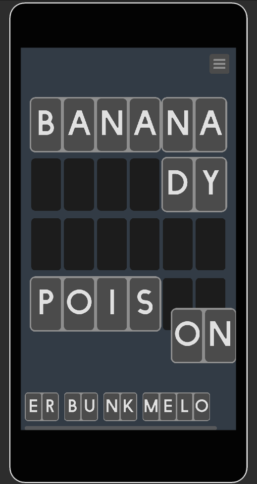

# Word Puzzle Demo



This demo provides an example of a game that uses Unity Gaming Services. 
In this game player reconstructs 4 words out of given letter clusters 
(2-4 letters long), words order on game board doesn't matter.
Game puzzles (levels) are delivered via Remote Config.

## Quick Start

Unity version 2022.3.11

After importing the project in Unity Editor, go to the UGS Dashboard (https://cloud.unity.com/), 
navigate to word-puzzle-demo project and add the following keys 
to the Remote Config (keys are available in 
`Assets/WordPuzzle/Configuration/Runtime/ConfigKeys.cs`):
- `puzzle_tutorial` (JSON): contains single puzzle for the first app launch.
- `puzzle_sample` (JSON): contains a set of puzzles of different lengths 
for the main game mode.
- `puzzle_sets` (JSON): contains a set of words grouped by length
(basically a dictionary for runtime puzzle generation (not implemented yet)).


    Important: double check that the imported project is connected to clound 
    in Unity Hub 

## JSON Structures

- Puzzle
  ```json
  {
        "words": ["banana", "poison", "bunker", "melody"],
        "word_length": 6
  }
  
Puzzle can represent a single puzzle or just be a collection of words 
of the same length, which can be used to generate random puzzles in runtime.

- Puzzle Set
  ```json
  {
    "puzzles": [
    {
      "words": ["pepper", "casque", "engine", "flower"],
      "word_length": 6
    }, 
    {
      "words": ["monster", "gazette", "sweater", "pioneer"],
      "word_length": 7
    }]
  }

## Project Architecture

Project does not implement any particular architectural approach (like MVVM) since 
its a simple demo. All classes are what they are and
representing the model, the presentation and the controller altogether 
if required, but thanks to Single Responsibility Principle classes are 
very atomic and its easy to extract particular interfaces if needed.
Zenject is used to wire up different components of the game 
and together with SRP provides enough flexibility for future development.

### Packages:

- Zenject 9.2.0
- UniTask 2.5.10
- DoTween 1.2.765
- UnityTools 0.1.2 (https://github.com/codeabuse/unity-tools)

### Scenes:

- `Startup`: app initialization occurs here through `StartupHelper`, which calls 
`IStartupProcedure` objects sequentially.
- `Menu`: contains main menu.
- `Gameplay`: main game scene.

### Important Classes:

- `GameManager`: controls the gameplay by retrieving settings and initializing 
gameplay loop. Injections: `IPuzzleManager`, `IPopUpMenu`.
- `GameBoard`: creates game board and shows the end game screen when the puzzle 
is solved. Injections: `IWordCutter`, `IPopUpMenu`.
- `SettingsController`: maintains Settings menu. Injections: `IPuzzleManager`.
- `GameplaySceneInstaller`: composition root of the `Gameplay` scene, defines 
most of the project dependencies (prefab pools, signals etc).
- `RemoteConfigManager`: retrieves the remote configuration for the game and 
creates `PuzzleManager`. Injections: `ILoadProgressHandler`.
- `WordCell`, `LetterCell`, `Letter`, `LettersCluster`, `ClustersDockArea`: 
main gameplay elements.
- `SceneLoader`: simplifies the scene loading configuration and completely 
- remove scenes manipulation from other classes.

### Important Prefabs

- `Assets/WordPuzzle/Resources/ProjectContext.prefab` - project context 
that is spawned once by Zenject and marked as DontDestroyOnLoad. Contains 
`PopupMenu` (end game/pause) and `LoadingScreen` as child objects.

The rest of the prefabs are self-explained by names.# Word Puzzle Demo


This demo provides an example of a game that uses Unity Gaming Services. 
In this game player reconstructs 4 words out of given letter clusters 
(2-4 letters long), words order on game board doesn't matter.
Game puzzles (levels) are delivered via Remote Config.

## Quick Start

Unity version 2022.3.11

After importing the project in Unity Editor, go to the UGS Dashboard (https://cloud.unity.com/), 
navigate to word-puzzle-demo project and add the following keys 
to the Remote Config (keys are available in 
`Assets/WordPuzzle/Configuration/Runtime/ConfigKeys.cs`):
- `puzzle_tutorial` (JSON): contains single puzzle for the first app launch.
- `puzzle_sample` (JSON): contains a set of puzzles of different lengths 
for the main game mode.
- `puzzle_sets` (JSON): contains a set of words grouped by length
(basically a dictionary for runtime puzzle generation (not implemented yet)).


    Important: double check that the imported project is connected to clound 
    in Unity Hub 

## JSON Structures

- Puzzle
  ```json
  {
        "words": ["banana", "poison", "bunker", "melody"],
        "word_length": 6
  }
  
Puzzle can represent a single puzzle or just be a collection of words 
of the same length, which can be used to generate random puzzles in runtime.

- Puzzle Set
  ```json
  {
    "puzzles": [
    {
      "words": ["pepper", "casque", "engine", "flower"],
      "word_length": 6
    }, 
    {
      "words": ["monster", "gazette", "sweater", "pioneer"],
      "word_length": 7
    }]
  }

## Project Architecture

Project does not implement any particular architectural approach (like MVVM) since 
its a simple demo. All classes are what they are and
representing the model, the presentation and the controller altogether 
if required, but thanks to Single Responsibility Principle classes are 
very atomic and its easy to extract particular interfaces if needed.
Zenject is used to wire up different components of the game 
and together with SRP provides enough flexibility for future development.

### Packages:

- Zenject 9.2.0
- UniTask 2.5.10
- DoTween 1.2.765
- UnityTools 0.1.2 (https://github.com/codeabuse/unity-tools)

### Scenes:

- `Startup`: app initialization occurs here through `StartupHelper`, which calls 
`IStartupProcedure` objects sequentially.
- `Menu`: contains main menu.
- `Gameplay`: main game scene.

### Important Classes:

- `GameManager`: controls the gameplay by retrieving settings and initializing 
gameplay loop. Injections: `IPuzzleManager`, `IPopUpMenu`.
- `GameBoard`: creates game board and shows the end game screen when the puzzle 
is solved. Injections: `IWordCutter`, `IPopUpMenu`.
- `SettingsController`: maintains Settings menu. Injections: `IPuzzleManager`.
- `ProjectInstaller`: composition root of the project level, binds `PopUpMenu` 
and `LoadingScreenController` so other components can work with them.
- `GameplaySceneInstaller`: composition root of the `Gameplay` scene, defines 
most of the project dependencies (prefab pools, signals etc).
- `RemoteConfigManager`: retrieves the remote configuration for the game and 
creates `PuzzleManager`. Injections: `ILoadProgressHandler`.
- `WordCell`, `LetterCell`, `Letter`, `LettersCluster`, `ClustersDockArea`: 
main gameplay elements.
- `SceneLoader`: simplifies the scene loading configuration and completely 
- remove scenes manipulation from other classes.

### Important Prefabs

- `Assets/WordPuzzle/Resources/ProjectContext.prefab` - spawned by Zenject 
once at the start and marked as DontDestroyOnLoad. Contains `EventSystem`, 
`PopupMenu` (end game/pause) and `LoadingScreen` as child objects.
